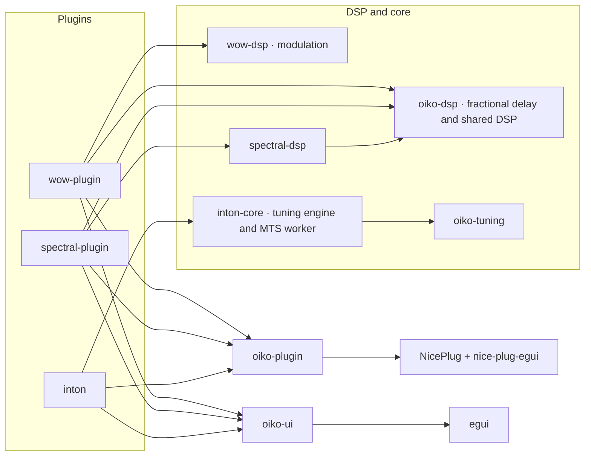

# Architecture and local integration

Arrows mean “depends on.” DSP and core crates have no NicePlug, egui, or window dependencies.

WoW's fractional delay readers, interpolation kernels, and oversampling live in `oiko-dsp::fractional_delay`; its modulation behavior belongs to `wow-dsp::modulation`. The plugin depends on both crates directly. `wow-dsp` has no dependencies. Consumers import shared gain, pitch, and delay helpers directly from `oiko-dsp`.

Weft's `spectral-dsp` owns note masks, the particle engine, spectral motion, and synthesis-window processing. `spectral-plugin` owns the NicePlug STFT buffer adapter and event translation; its `particle_adapter` maps host notes, transport, and parameters into the core particle engine. Host parameter definitions belong to `parameters`, persisted fields and state validation to `state`, and curve transform calculations to `curve`. Each FFT plan has frequency and analysis/synthesis tables prepared at activation, along with FFT scratch storage sized by the realfft API. Resolution changes select prepared plans and change the active lengths of preallocated working buffers.

DSP buffer and table construction can allocate. Preparation and resource destruction belong outside audio callbacks; processing reuses prepared storage without heap allocation or deallocation. The real-time rules in [engineering-principles.md](engineering-principles.md) apply to reconfiguration and state transitions as well as steady processing.

Inton is a microtuning controller plugin and MTS-ESP tuning master: it manages scales, morphs between tunings, and publishes tuning updates to compatible instruments and plugins. `inton-core` owns tuning preparation, validated project state, morphing, scale-edit drafts, parameter mailboxes, and the MTS control worker. `inton` owns NicePlug parameters, host state transport, the editor, library presentation, and preferences. The plugin, tests and examples import core APIs directly from `inton-core`. NicePlug handles the host state envelope, and Inton validates the embedded project before applying it. The C++20 parser wrapper belongs to `oiko-tuning`, a dependency of `inton-core`, and uses the single tuning-library patch in this repository.

Inton's `engine::Parameter` identifies internal parameter routes; numerical indices are confined to array storage and host metadata lookup. `Shared::edit_parameter` queues independent, coalesced control edits, and the editor host bridge drains them through `take_parameter_edits`. Atomic values and pending bits stay private to the protocol. Host callbacks continue to use the bounded parameter mailbox without locking or waiting.

Inton carries immutable validated scales from the library or draft through audition, slot updates and undo history. A draft caches its current revision, so its preview, live audition and Apply share prepared data; changing the draft invalidates that revision. Individual slot changes retain the other prepared scales. Project serialization contains source presets, and a validated load transaction prepares them before replacing the session. The host adapter also validates incoming project state before accepting it.

`oiko-plugin::parameter_controls` provides WoW and Weft's parameter drag behavior, with explicit per-control sensitivity and modifier policies. `oiko-plugin::gestures` owns host gesture lifetimes, including complete discrete edits. Painting and product-local undo belong to each editor. Inton's editor model represents browser tabs, assignment intents, inspection targets, and overlays explicitly. Its `HostRef` connects editor actions to the host bridge; standalone previews and tests use `HostRef::disconnected()`. Weft's editor coordinates local `controls`, `curve`, `rendering`, `history`, and `parameter_history` modules. Its history entries distinguish curve, note, and parameter edits. Inton's editor keeps browser interactions in `browser`, draft editing and draft history in `scale_editor`, project slot interactions in `scale_set`, and diagrams and icons in `rendering`. These modules retain product-specific layout and behavior.

WoW and Weft pass audio-to-UI display data through dedicated `display_data` plugin modules, independent of egui. Approximate display values are not an input to their DSP. All products initialize window geometry through `oiko_plugin::editor_state`. UI scale changes belong to the editors and use `oiko-ui::scale`; the window adapter handles host resizing outside UI callbacks. Persisted UI scale defaults to 100% for all three products. Invalid values fall back to 100%. All three editors use Ubuntu Regular, four text sizes, and the shared Oiko palette and header/About/zoom controls from `oiko-ui`. Layouts and view preferences belong to each product.

One root Cargo workspace owns dependency versions, upstream patches, the lockfile, and build profiles. Plugins inherit only the dependencies they use. `scripts/check_workspace.py` discovers every workspace member from Cargo metadata and checks vendor hashes and declared crate boundaries. Each package declares its `core`, `integration`, `ui`, `host`, `plugin`, or `tool` role in `package.metadata.oiko`. Product crates also declare their product; consumers of integration crates explicitly name them in `integrations`. The checker examines normal and build dependencies with all features enabled, rejects unclassified members, and prevents shared crates or other products from acquiring product-specific dependencies. Development dependencies remain available for test harnesses. With `--test`, it also runs formatting, Clippy, and test suites for the workspace, individual plugins, and patched framework behavior.

## Product dependencies

ODDSound/MTS belongs to its consumers. Weft's `spectral-plugin::mts_client` owns MTS client registration, tuning reads, and snapshots for the editor. Inton loads the MTS runtime through `inton-core`. WoW and the shared DSP, UI, and host crates have no MTS integration.

The vendored Surge tuning-library is a scale parser, separate from ODDSound. Only `inton-core` depends on the `oiko-tuning` crate that builds its native wrapper. Its patched source is stored centrally in `vendor/`; other plugins do not compile, link, load, or install it.

Keep integrations out of the shared DSP, UI, and host crates. If multiple products need the same integration later, give it a separate crate with an explicit dependency in each consumer. Sharing a font or a window adapter must never require an unrelated runtime, registration step, or background worker.

## Known timing and platform boundaries

Inton's control worker publishes MTS updates on a 5 ms wall-clock cadence. Weft reads global MTS client tuning once per block, separate from Inton's master publication API. These reads enter external C++ code; bounded Rust loops and Rust allocation guards alone do not establish the runtime's real-time safety. Each Weft processor owns one MTS receiver; opening or closing its editor does not register another client. The editor reads a bounded atomic snapshot of the processor's last tuning, retaining the previous snapshot if a publication overlaps its read. When processing stops, the editor retains the last processed tuning.

The macOS adapter uses AppKit logical points and queues viewport changes. Windows/Linux use NicePlug/baseview's native scale handling. Automated Linux tests cannot certify native Windows or macOS host windows. Follow the host matrix in [engineering-principles.md](engineering-principles.md) before publishing binaries. AU distribution is suspended.
