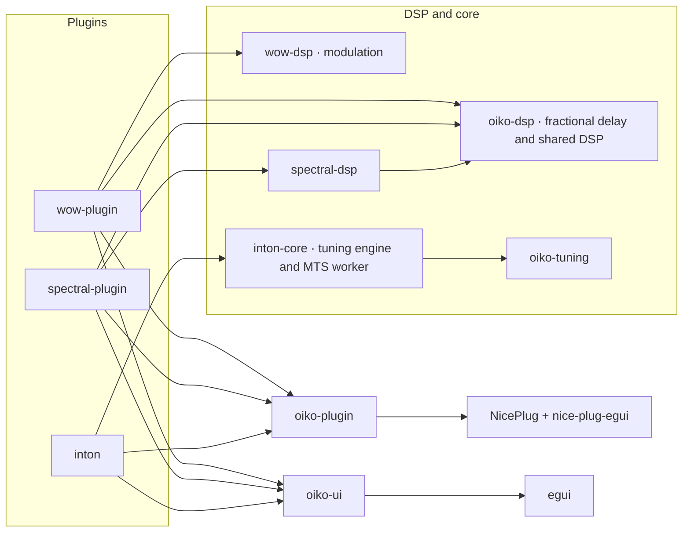

# Architecture and local integration

An arrow means "depends on". DSP and core crates have no NicePlug, egui or window dependencies.

`oiko-dsp::fractional_delay` contains Wow's fractional delay readers, interpolation kernels and oversampling. `wow-dsp::modulation` contains Wow's modulation, which is its two oscillators, seeded Drift and stereo delay offsets. `wow-plugin` depends on both crates. `wow-dsp` has no dependencies. Consumers import the shared gain, pitch and delay helpers from `oiko-dsp` itself.

Weft's `spectral-dsp` contains note masks, the particle engine, spectral motion and synthesis-window processing. `spectral-plugin` contains the NicePlug STFT buffer adapter and translates host events. Its `particle_adapter` module maps host notes, transport and parameters into the core particle engine. In `spectral-plugin`, `parameters` defines the host parameters, `state` holds the persisted fields and validates state, and `curve` calculates curve transforms. At activation, Weft prepares every FFT plan with its frequency tables, its analysis and synthesis tables, and FFT scratch storage sized by the realfft API. A resolution change selects a prepared plan and changes the active length of the preallocated working buffers.

Building DSP buffers and tables can allocate, so preparation and resource destruction happen outside audio callbacks. Processing reuses prepared storage and never allocates or frees heap memory. The real-time rules in [engineering-principles.md](engineering-principles.md) apply to reconfiguration and state transitions as well as steady processing.

Inton is a microtuning controller plugin and MTS-ESP tuning master. It manages scales, morphs between tunings and sends tuning updates to MTS-ESP instruments and plugins. `inton-core` contains tuning preparation, validated project state, morphing, scale-edit drafts, parameter mailboxes and the MTS control worker. `inton` contains the NicePlug parameters, host state transport, the editor, library presentation and preferences. The plugin, tests and examples import core APIs from `inton-core` itself. NicePlug handles the host state envelope, and Inton validates the embedded project before applying it. `oiko-tuning`, a dependency of `inton-core`, contains the C++20 parser wrapper. It builds the single patched tuning-library in `vendor/tuning-library`.

Inton's `engine::Parameter` type names each internal parameter route. Numeric indices appear only in array storage and host metadata lookup. The editor queues control edits with `Shared::edit_parameter`, which keeps only the latest value for each parameter. The editor host bridge collects them with `take_parameter_edits`. The atomic values and pending bits are private to this protocol. Host callbacks use the bounded parameter mailbox and never lock or wait.

Inton passes immutable, validated scales from the library or a draft through audition, slot updates and undo history. A draft caches its current revision, so its preview, live audition and Apply use the same prepared data. Any change to the draft invalidates that revision. Changing one slot keeps the prepared scales in the other slots. A saved project contains the source presets. Loading prepares and validates them in one transaction before it replaces the session. The host adapter also validates incoming project state before accepting it.

`oiko-plugin::parameter_controls` implements parameter dragging for Wow and Weft. Each control sets its own drag sensitivity and modifier-key behavior. `oiko-plugin::gestures` tracks when each host gesture begins and ends. A click, keyboard edit or committed text entry is one complete gesture. Each editor does its own painting and keeps its own undo history. Inton's editor model has explicit types for browser tabs, assignment intents, inspection targets and overlays. Its `HostRef` connects editor actions to the host bridge, and standalone previews and tests use `HostRef::disconnected()`. Weft's editor is split into the `controls`, `curve`, `rendering`, `history` and `parameter_history` modules. Weft's history records curve, note and parameter edits as separate kinds of entry. Inton's editor keeps browser interactions in `browser`, draft editing and draft history in `scale_editor`, project slot interactions in `scale_set`, and diagrams and icons in `rendering`. These editor modules hold layout and behavior that belong to one product and are not shared.

Wow and Weft send display data from the audio thread to the UI through a `display_data` module in each plugin crate. These modules do not depend on egui. The DSP never reads the approximate display values. All three products create their window geometry with `oiko_plugin::editor_state`. Each editor changes the UI scale through `oiko-ui::scale`. The window adapter resizes the host window outside UI callbacks. The saved UI scale defaults to 100% in all three products, and an invalid saved value falls back to 100%. All three editors use Ubuntu Regular, four text sizes, the shared Oiko palette, and the shared header, About and zoom controls from `oiko-ui`. Each product defines its own layout and view preferences.

The root Cargo workspace sets the dependency versions, upstream patches, lockfile and build profiles. Each plugin depends only on the crates it uses. `scripts/check_workspace.py` reads every workspace member from Cargo metadata. It checks the vendor hashes in `vendor-checksums.json` and the declared crate boundaries. Each package declares its `core`, `integration`, `ui`, `host`, `plugin` or `tool` role in `package.metadata.oiko`. Product crates also declare their product. A consumer of an integration crate names that crate in `integrations`. The checker inspects normal and build dependencies with all features enabled. It rejects members without a role, and it fails if a shared crate or another product depends on a product-specific crate. It does not check development dependencies, so test harnesses can use any crate. With `--test`, it also runs formatting, Clippy and the test suites for the workspace, each plugin on its own, and the patched framework behavior.

## Product dependencies

Only the products that use ODDSound MTS-ESP depend on it. Weft's `spectral-plugin::mts_client` registers the MTS client, reads tunings and publishes tuning snapshots for the editor. Inton loads the MTS runtime through `inton-core`. Wow and the shared DSP, UI and host crates do not use MTS.

The vendored Surge tuning-library is a scale parser and is unrelated to ODDSound. Only `inton-core` depends on `oiko-tuning`, the crate that builds the parser's native wrapper. The patched parser source is in `vendor/tuning-library`. Other plugins do not compile, link, load or install it.

Keep integrations out of the shared DSP, UI and host crates. If more than one product needs the same integration, move it into its own crate and add an explicit dependency on that crate in each consumer. Using the shared font or window adapter must never pull in an unrelated runtime, registration step or background worker.

## Timing and platform limits

Inton's control worker publishes MTS updates every 5 ms of wall-clock time. Weft reads the global MTS client tuning once per audio block, through the client API and not through Inton's master publication API. These reads call external C++ code. Bounded Rust loops and Rust allocation guards do not prove that this code is real-time safe. Each Weft processor owns one MTS receiver, and opening or closing its editor does not register another client. The editor reads a bounded atomic snapshot of the processor's last tuning. If a publication overlaps the read, the editor keeps its previous snapshot. When processing stops, the editor keeps showing the last processed tuning.

On macOS, the window adapter works in AppKit logical points and queues viewport changes. On Windows and Linux, it uses the native scale handling in NicePlug and baseview. Automated Linux tests cannot show that native host windows work on Windows or macOS. Follow the host matrix in [engineering-principles.md](engineering-principles.md) before publishing binaries. Oiko does not currently distribute AU builds.
